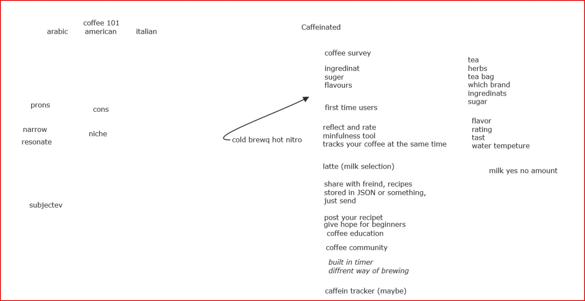
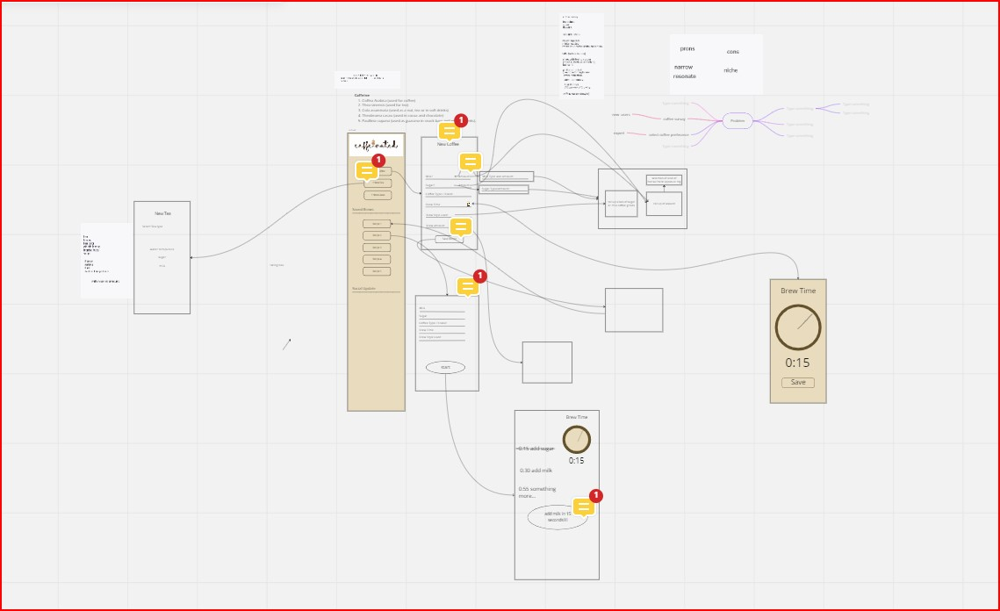

# WEEK 4  BrainStorming #
---
- Date 10/18/2022
---
- Palce Zoom
---
Team member info:  
- [X] Matthieu Dante Pardin - Team Lead (mpardin@ucsd.edu) 
- [X] Sarkis Bouzikian - Team Lead (sbouzikian@ucsd.edu) 
- [ ] Alexander Kourjanski - Planner (akourjan@ucsd.edu) 
- [X] Daniel Ziper - Designer (dziper@ucsd.edu) 
- [X] Pratyush Sahu - Developer (psahu@ucsd.edu) 
- [X] Kyrell Ringpis - Developer (kringpis@ucsd.edu) 
- [X] Yanbo Yu - Developer (yay023@ucsd.edu) 
- [X] Eric Tran - Developer (e7tran@ucsd.edu) 
- [ ] Derek Zhu - Developer (daz005@ucsd.edu) 
- [X] Ella Tung - Developer (etung@ucsd.edu)
---

## requierments ##
- Personal information managmen
- CRUD 
- Local First
- Collaborative
---
# Meeting Breakdown #

- talk about what we need to do this week and the coming week 
- Daniel/Sarkis idea Caffein tracking recipies app, that includes coffee 
- Dante to make a app keep track of resume easy editibale

then we talk about more detail how to go and build the app Caffeianted that works with our team moto 
the following pdf is notes taken during the brainstorm on the app idea.
 

